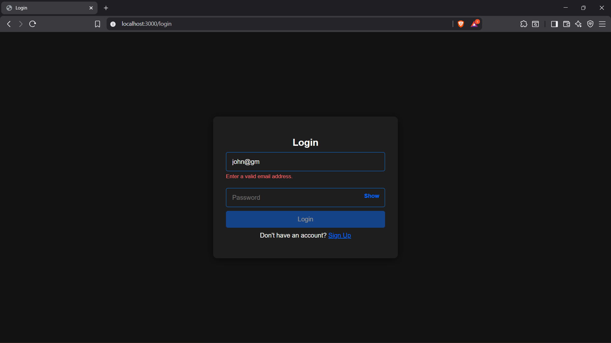
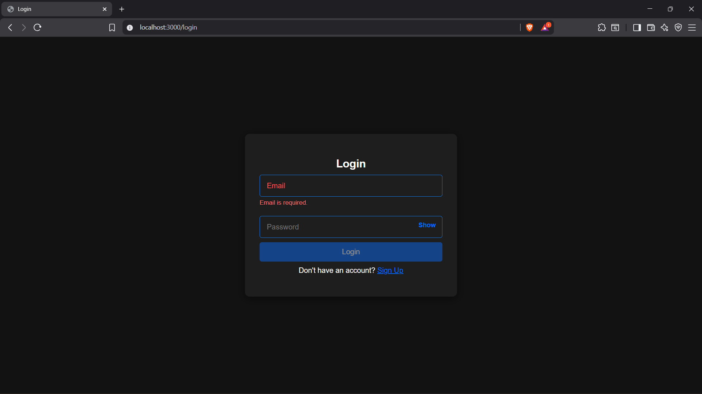
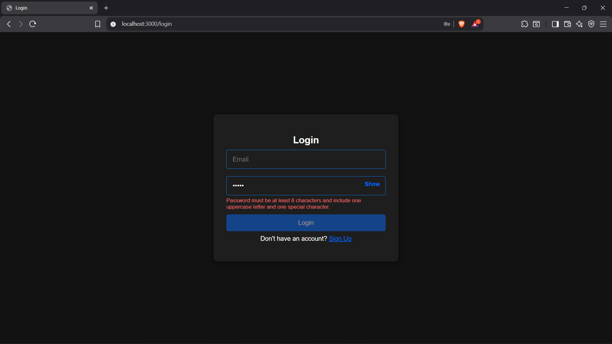
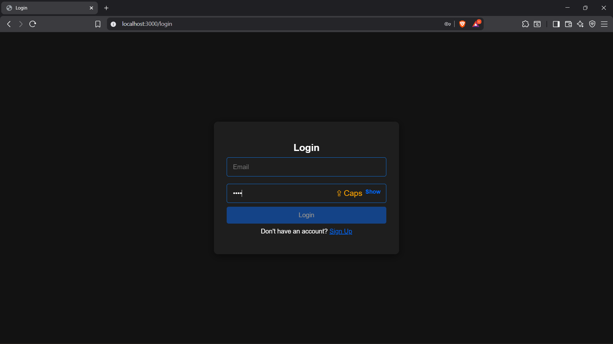
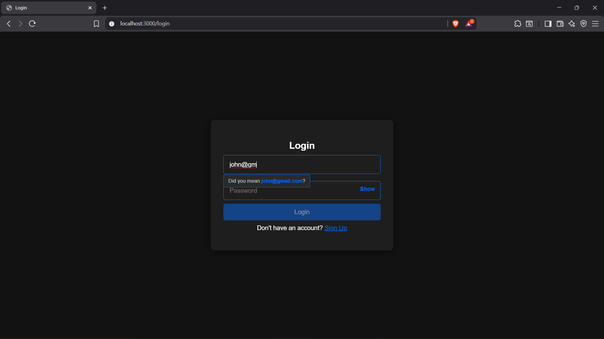
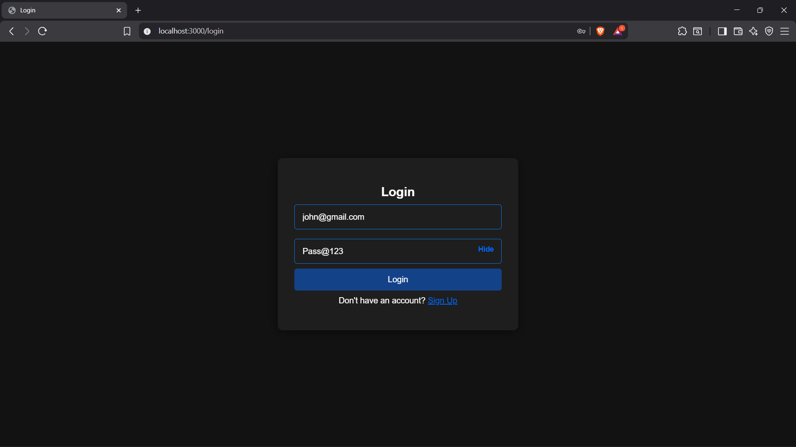

## 1. DOM Validation Test Cases - Login Page 

| Case | Input | Expected Result | Actual Result | Status | Screenshot |
| :--- | :--- | :--- | :--- | :--- | :--- |
| **Invalid Email Format** | `Email: john@gm` | Placeholder shows "Invalid email format" in red. Button remains disabled. | Placeholder turns red with error message. Sign In button stays disabled with opacity 0.5. | Passed |  |
| **Empty Email** | Email field left empty, user clicks outside | Placeholder shows "Email is required" in red with shake animation. | Error message appears with shake effect. Button disabled. | Passed |  |
| **Invalid Password** | `Password: 12345` | Placeholder shows "Password must be at least 6 characters" in red. | Error message displays. Button remains disabled. | Passed |  |
| **Caps Lock Warning** | User types with Caps Lock ON | Warning message "⚠️ Caps Lock is ON" appears below password field. | Warning displays in real-time. | Passed |  |
| **Email Domain Suggestions** | `Email: john@gm` | Dropdown suggests: gmail.com, gmx.com with clickable options. | Suggestion list appears below email field. | Passed |  |
| **Valid Credentials** | `Email: john@gmail.com`, `Password: Pass@123` | All errors clear. Sign In button becomes enabled (opacity 1, cursor pointer). | Button enabled. Form submits successfully. | Passed |  |

---

## 2. DOM Validation Test Cases - Signup Page 

| Case | Input | Expected Result | Actual Result | Status | Screenshot |
| :--- | :--- | :--- | :--- | :--- | :--- |
| **Empty Name** | Name field left empty, user clicks outside | Placeholder shows "Name is required" in red. Sign Up button disabled. | Error message appears. Button stays disabled. | Passed |  |
| **Invalid Email** | `Email: user@` | Placeholder shows "Invalid email format" in red. | Error message appears immediately on blur. | Passed |  |
| **Weak Password** | `Password: pass` | Password strength meter shows "Weak" in red. Placeholder error appears. | Strength meter displays red bar with "Weak" label. Button disabled. | Passed |  |
| **Medium Password** | `Password: Pass123` | Password strength meter shows "Medium" in orange. | Orange bar displays with "Medium" label. Still requires special character. | Passed |  |
| **Strong Password** | `Password: Pass@123` | Password strength meter shows "Strong" in green. | Green bar displays with "Strong" label. Password field valid. | Passed |  |
| **Password Mismatch** | `Password: Pass@123`, `Confirm: Pass@124` | Confirm password shows "❌ Passwords do not match" in red. | Red mismatch indicator appears. Button disabled. | Passed |  |
| **Password Match** | `Password: Pass@123`, `Confirm: Pass@123` | Confirm password shows "✓ Passwords match" in green. | Green match indicator appears. | Passed |  |
| **Valid Signup** | `Name: John Doe`, `Email: john@gmail.com`, `Password: Pass@123`, `Confirm: Pass@123`, Terms checked | All errors clear. Sign Up button enabled. Progress: "Step 4 of 4 Complete". | Button enabled. Account created successfully. Redirects to home page. | Passed |  |

---

## 3. DOM Validation Test Cases - Recruiter Signup Page 

| Case | Input | Expected Result | Actual Result | Status | Screenshot |
| :--- | :--- | :--- | :--- | :--- | :--- |
| **Empty Name** | Name field left empty, user clicks outside | Placeholder shows "Name is required" in red with shake. | Error message appears with shake animation. | Passed |  |
| **Invalid Email** | `Email: recruiter@` | Placeholder shows "Invalid email format" in red. | Error displays immediately on blur. | Passed |  |
| **Weak Password** | `Password: weak` | Password strength meter shows "Weak" in red. Button disabled. | Red strength bar displays. Validation fails. | Passed |  |
| **Strong Password** | `Password: Recruit@123` | Password strength meter shows "Strong" in green. | Green bar displays with "Strong" label. Field valid. | Passed |  |
| **Password Mismatch** | `Password: Recruit@123`, `Confirm: Recruit@124` | Confirm shows "❌ Passwords do not match" in red. | Red mismatch indicator appears. | Passed |  |

---

## 4. DOM Validation Test Cases - Create Project Page 

| Case | Input | Expected Result | Actual Result | Status | Screenshot |
| :--- | :--- | :--- | :--- | :--- | :--- |
| **Empty Project Name** | Project name field left empty, user clicks outside | Inline error message: "Project name is required" appears below field in red. | Error displays below input field. Button disabled. | Passed |  |
| **Short Project Name** | `Project Name: AB` | Inline error: "Project name must be at least 3 characters". | Error message appears below field. Validation fails. | Passed |  |
| **Long Project Name** | `Project Name:` (101 characters) | Inline error: "Project name must be less than 100 characters". | Error displays with character count exceeded. | Passed |  |
| **Empty Description** | Description field left empty | Inline error: "Description is required" appears in red below textarea. | Error message shown. Character counter shows "0/500". | Passed |  |
| **Short Description** | `Description: Short` | Inline error: "Description must be at least 10 characters". Counter shows "5/500" in red. | Error displays with live character count. | Passed |  |
| **Valid Description** | `Description:` (50 characters of valid text) | Character counter shows "50/500" in green. No error message. | Counter updates in real-time in green color. Validation passes. | Passed |  |
| **Long Description** | `Description:` (501 characters) | Inline error: "Description cannot exceed 500 characters". Counter shows "501/500" in red. | Error displays. Counter turns red exceeding limit. | Passed |  |
| **Invalid Capacity** | `Capacity: 0` | Inline error: "Capacity must be between 3 and 100". | Error message appears below capacity field. | Passed |  |
| **No Topic Selected** | Topic dropdown left at default "Select a topic" | Inline error: "Please select a project topic". | Error appears on blur. Button disabled. | Passed |  |

